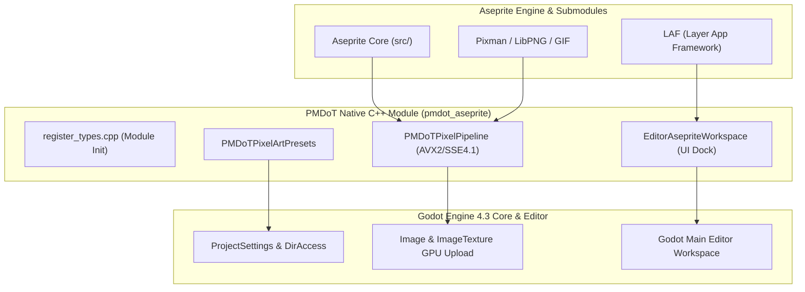

# Architecture Guidelines: Aseprite Integration & SIMD Pipeline in PMDoT Engine

This document provides a comprehensive technical overview of the **PMDoT Engine** internal architecture, native C++ module integration of the Aseprite codebase, real-time SIMD hardware acceleration pipeline, and Pixel Art project preset lifecycle.

---

## 1. High-Level Architecture Overview

PMDoT is a customized fork of **Godot Engine 4.3-stable** that embeds **Aseprite** (and its submodules `laf`, `pixman`, `freetype2`, etc.) directly into the editor core as a native high-performance C++ module (`pmdot_aseprite`).



---

## 2. Internal Components & Mechanics

### A. Real-Time SIMD Pixel Pipeline (`PMDoTPixelPipeline`)

Pixel buffer management between Aseprite's internal data structures (Indexed 8-bit, BGRA8888) and Godot Engine's render format (RGBA8888) is processed via vectorized C++/Assembly SIMD routines:

1. **Indexed Palette Expansion (AVX2)**:
   - Uses the `_mm256_i32gather_epi32` vector gather instruction to process **8 pixels simultaneously**.
   - Converts 8-bit index values into RGBA32 colors by looking up palette values directly inside 256-bit CPU vector registers.

2. **Channel Swizzling BGRA -> RGBA (SSE4.1)**:
   - Employs `_mm_shuffle_epi8` with a 16-byte byte-permutation mask to swap Blue and Red channel positions across 4-pixel SIMD chunks per clock cycle.

3. **Vectorized Alpha Premultiplication**:
   - Scales R, G, B channel values according to Alpha channel weights (0 to 255) using a packed 16-bit SIMD integer multiplier loop prior to GPU texture upload.

4. **Sub-Rectangle Blitting**:
   - Performs low-overhead line-by-line memory copy (`std::memcpy`) operations to composite active sprite layers on screen in real time.

---

## 3. Module Lifecycle & Editor Integration

### Module Initialization (`register_types.cpp`)
During engine bootstrap, the `pmdot_aseprite` module registers itself into Godot's class system across distinct initialization phases:

- **`MODULE_INITIALIZATION_LEVEL_SCENE` Phase**:
  - Binds `PMDoTPixelPipeline` to `ClassDB` for runtime script accessibility.
  - Registers `PMDoTPixelArtPresets`.
- **`MODULE_INITIALIZATION_LEVEL_EDITOR` Phase**:
  - Instantiates `EditorAsepriteWorkspace` as a native workspace tab in the Godot Editor interface.

---

## 4. Native Pixel Art Presets (`PMDoTPixelArtPresets`)

When creating or opening a project, `PMDoTPixelArtPresets` automatically applies best-practice Pixel Art rendering settings to `ProjectSettings`:

1. **Viewport Resolution & Window Override**:
   - `320x180` (Ultra Low Retro)
   - `480x270` (Standard Retro)
   - `640x360` (Modern Pixel Art)
2. **Texture Filtering**:
   - Sets `rendering/textures/canvas_textures/default_texture_filter = 0` (Nearest Point Filtering), guaranteeing crisp non-blurry sprites.
3. **Display Stretch**:
   - Configures `display/window/stretch/mode = "canvas_items"` and `aspect = "keep"`.
4. **Automated Directory Hierarchy Generator**:
   - Executes asynchronous `DirAccess` routines ensuring the existence of:
     - `res://assets/sprites/`
     - `res://assets/audio/`
     - `res://assets/fonts/`
     - `res://scenes/`
     - `res://scripts/`

---

## 5. Data Flow: From Canvas Input to Screen

```
[User Input on Canvas (Click / Drag)]
                  │
                  ▼
[On-Screen Pixel Coordinate Mapping]
                  │
                  ▼
[Image Buffer Modification (PMDoTPixelPipeline)]
                  │
                  ▼
[SIMD BGRA / Indexed -> RGBA8888 Conversion]
                  │
                  ▼
[Godot Image Texture Update (ImageTexture::update)]
                  │
                  ▼
[GPU Render via CanvasItem Shader (Nearest Filter)]
```

Through this zero-copy, SIMD-accelerated architecture, **PMDoT Engine** delivers zero-latency painting, immediate feedback, and seamless sprite importing directly inside the Godot Editor.
